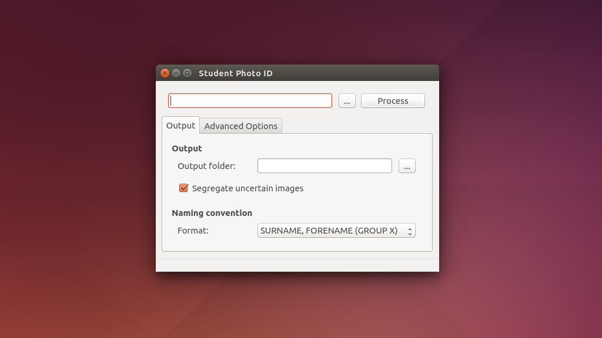

# Student Photo ID

Uses OpenCV 2 and Tesseract OCR to sort through a folder of photographs and automatically rename them using a name plate in the image. Print each person's nameplate onto the red paper using OCR-B font.

Compiles on Ubuntu Linux, with Windows coming soon.

## Screenshots

## Icon

[Running Man](https://www.elegantthemes.com/blog/freebie-of-the-week/beautiful-flat-icons-for-free)