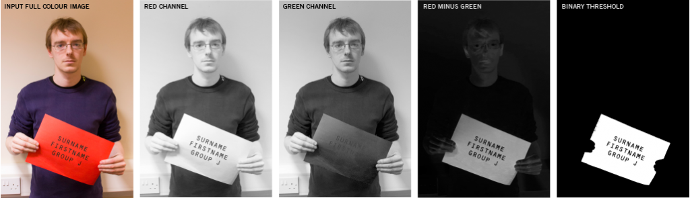

# Student Photo ID

Uses OpenCV 2 and Tesseract OCR to sort through a folder of photographs and automatically rename them using a name plate in the image. Print each person's nameplate onto red paper using OCR-B font.

Compiles on Ubuntu Linux, with Windows coming soon.

## OpenCV Processing Flow

Each image has the red channel subtracted from the green channel which results in a distinct separation of the red name tag from the rest of the photo. Running the subtracted layers through a binary threshold typically results in a large contour which can be cropped and straightened for use in the OCR.

## To Do

* Compile for Windows
* Move processing code to separate class, and out of the interface code.
* Create a new thread for the processing code.

## Screenshots

## Icon

[Running Man](https://www.elegantthemes.com/blog/freebie-of-the-week/beautiful-flat-icons-for-free)