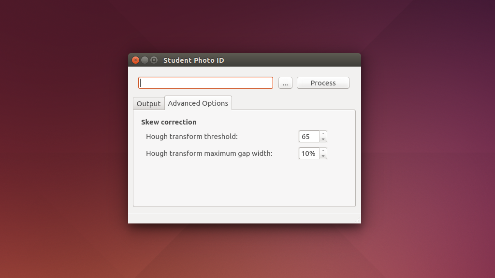

# Student Photo ID

Uses OpenCV 2 and Tesseract OCR to sort through a folder of photographs and automatically rename them using a name plate in the image. Print each person's nameplate onto red paper using OCR-B font.

_Please note: This code is for internal use only, and currently isn't particularly robust or precise._

Compiles on Ubuntu Linux, with Windows coming soon. 

## This seems like a waste of time, why not use student cards to identify the students?

Two reasons:

* This software is used is in the first week of term, first year (Before all students have picked up their student cards.)
* It allows anyone to take the photographs with a normal camera, no extra hardware required.

## OpenCV Processing Flow
 
Each image has the red channel subtracted from the green channel which results in a distinct separation of the red name tag from the rest of the photo. Running the subtracted layers through a binary threshold typically results in a large contour which can be cropped and straightened for use in the OCR.
  
Straightening is performed using [OpenCV's Hough Lines transform](http://docs.opencv.org/2.4/doc/tutorials/imgproc/imgtrans/hough_lines/hough_lines.html) and has been tuned to give the best results with the name plate provided, although some characteristics can be adjusted using the advanced settings tab.

## Compiling

These instructions are here to be helpful, if they don't work then I'm afraid you are on your own. 

### On Ubuntu 14.04

This was tested with a fresh install of 64 bit Ubuntu 14.04 "Trusty Tahr".

 * Install OpenCV 2 by following [these instructions](http://computervisionwithvaibhav.blogspot.co.uk/2015/07/installing-opencv-300-on-ubuntu-1404_24.html). In step 3, **do not** include `-D WITH_QT=ON` when running cmake.
 * In a terminal window run `$ sudo apt-get install qtcreator` to install QT Creator and the QT5 development environment.
 * Then install Tesseract-OCR and the english language file: `$ sudo apt-get install tesseract-ocr tesseract-ocr-eng libtesseract-dev`

## Usage

 * Photograph a number of people holding red sheets of paper printed with data in the form demonstrated in "nameplate.odt". The typeface should be OCR-B - Tesseract-OCR works nicely with this.
 * Compile and then start the software.
 * Point the uppermost text box at the folder (click `...` or type the full path) containing the input images.
 * Point the `Output folder` box to an existing folder you want to deposit the named files.
 * If the `Segregate uncertain images` checkbox is checked, files which can't be processed by the OCR will be sorted into a seperate output subfolder called "uncertain" rather than being ignored. This is the recommended behaviour.
 * Select a naming convention.
 * Click the `Process` button to start the sorting and renaming. Depending on the number of images you have this can take a few minutes, so be patient.

## To Do

* Compile for Windows
* This code is messy, and it needs tidying up.
* Move processing code to separate class, and out of the interface code.
* Create a new thread for the processing code.

## Screenshots

## Icon

[Running Man](https://www.elegantthemes.com/blog/freebie-of-the-week/beautiful-flat-icons-for-free)
